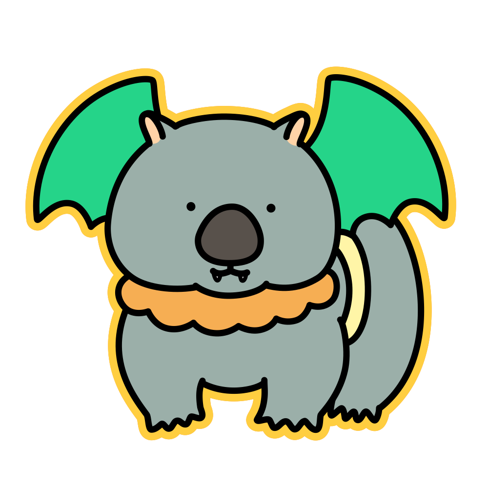
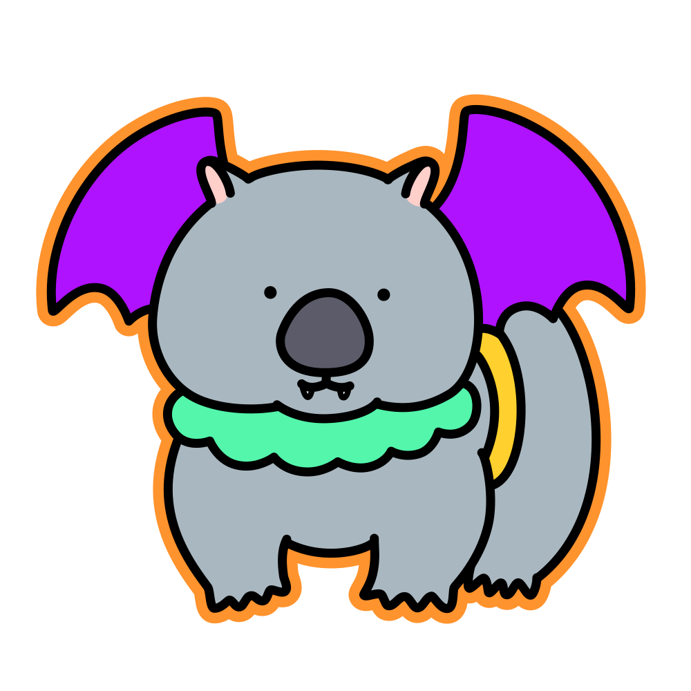

# Wombat



[](https://github.com/kojix2/wombat/actions/workflows/test.yml)
[](https://kojix2.github.io/wombat/)

Wombat is a Crystal binding for the well-known [bat](https://github.com/sharkdp/bat) syntax highlighting library. `bat` is a `cat(1)` clone with wings, popular among developers for its syntax highlighting capabilities. With Wombat, you can utilize `bat`'s syntax highlighting functionality directly within your Crystal applications.


## About `bat`

- [bat](https://github.com/sharkdp/bat): A well-known `cat(1)` clone with syntax highlighting capabilities.
- [bat-c](https://github.com/kojix2/bat-c): A C wrapper for the `bat` library.

## Installation

1. **Add the dependency to your `shard.yml`:**

    ```yaml
    dependencies:
      wombat:
        github: kojix2/wombat
    ```

2. **Install the dependencies:**

    ```sh
    shards install
    ```

During installation, a `postinstall` script will automatically download the static library for `bat-c` into the `src/ext` directory.

## Usage

### Obtain a Syntax Highlighted String

Retrieve and output a syntax highlighted string:

```crystal
require "wombat"

highlighted = Wombat.pretty_string(%{puts "hello world"})
puts highlighted
```

### Output a Syntax Highlighted File

Output the contents of a file with syntax highlighting. `bat` will automatically invoke `less`:

```crystal
require "wombat"

Wombat.pretty_print_file("/path/to/your_file.cr")
```

For more details, refer to the [API Documentation](https://kojix2.github.io/wombat/).

## Development

Sustainable development is important. If you encounter any issues or have suggestions for improvement, please contribute!

## Contributing

Your contributions are always welcome! Feel free to raise issues, submit pull requests, or suggest new features.
